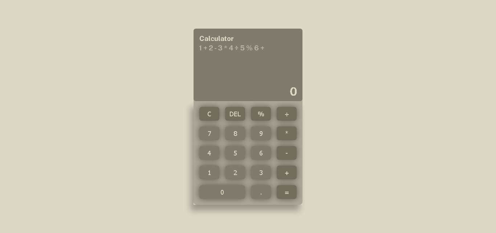

# Calculator Project

A Javascript Project in The Odin Project

Both keyboard and mouse input works to operate

### Preview

### Links

- The Odin Project [https://www.theodinproject.com/](https://www.theodinproject.com/)

- Live Demo: [https://nevz9.github.io/calculator-project/](https://nevz9.github.io/calculator-project/)

### Built with

- Basic HTML5 and CSS3
- Basic Javascript

#

This is the accumulation of what I've learned both in The Odin Project, Wes Bos Javascript Course, and a few youtube tutorials. It's all thanks to them for teaching me the logic and functionalities necessary to create this.